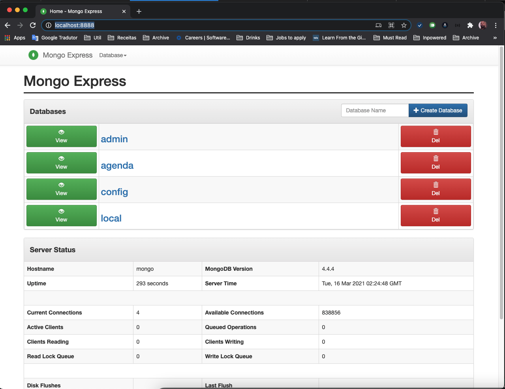

# go-agenda-api

Build an HTTP API that's responsible for handling a phone agenda (i know it's obvious, but the nuances on building the project are what really matters).

The http server should contain:

* An endpoint for pushing new contacts
* An endpoint for editing contact information
* An endpoint for deleting a contact
* An endpoint for searching a contact by it's id
* An endpoint for searching contacts by a part of their name
* An endpoint that lists all contacts
* The http service should be configurable through flags on startup (timeouts and port to use)
* Log messages should be written for each endpoint hit, with the response status code and the time it took to fulfill the request. If an error occurs, a log message should be written with the response status code and a helpful error message, to help an engineer troubleshoot the issue
* Service and host metrics should be collected. I suggest using Prometheus (https://prometheus.io/docs/guides/go-application/)
* The application should have a reasonable test coverage, preferably above 70%
* The application should have end-to-end tests (this is a good way to try out the http client)
* The application should contain a buildable Dockerfile (https://levelup.gitconnected.com/complete-guide-to-create-docker-container-for-your-golang-application-80f3fb59a15e) -- care on this, as using plainly the scratch image might hinder you from making https requests. Not that this will impact our example, but something to always take care into the future
* It would be nice for the application to have some type of storage to persist the data. I'll leave this open, feel free to pick any type of storage you want

## Dev environment

In order to execute this project you'll need to setup go env locally (in order to run the source files) and also docker with docker-compose installation

## Makefile

In order to facilitate running the processes locally a makefile with some tasks is available [here](./Makefile).

* make dev-start: starts the database, prometheus and all other required infrastructure containers to run the application locally
* make dev-stop: stops the local development containter, needed if you want to use the full stack
* make stack-start: starts all the basic infrastrucute containers and the backend app
* make stack-stop: stops the full stack
* make tests: runs the tests with coverage report (actually 90.9%)
* make mockgen: generates mock for the Store interface to mock database calls
* make server: starts the application (make dev-start is required to run this task)

## Environment variables

Basic configuration for the application can be found in env folder but it can be override by setting the following environment variables:
* DB_SERVER - host for the mongo database
* DB_NAME - database name
* SERVER_ADDRESS - server address 
* PROMETHEUS_SERVER - complete link for prometheus server
* READ_TIMEOUT - application read timeout
* WRITE_TIMEOUT - application write timeout

## Services, frameworks and libraries

1. [MongoDB](https://www.mongodb.com/) - for this sample we are using mongodb as the application database
2. [Viper](https://github.com/spf13/viper) - library to load configuration from files and override them by setting environment variables
3. [Gin](https://github.com/gin-gonic/gin) - Http library to configure our endpoints and middlewares
4. [Beforeeach](https://github.com/jknair0/beforeeach) - Support for unit test lifecycle methods (setup and tear down)
5. [go-gin-prometheus](https://github.com/zsais/go-gin-prometheus) - Wrapper to configure prometheus metrics
6. [mgo.v2](https://gopkg.in/mgo.v2) - Mongo driver for golang
7. [testify](https://github.com/stretchr/testify) - Toolkit with assertions for unit tests

### Mongo Client
In order to check the results of the API calls you might be doing there's a mongo-express service deployed on our stack which provides acess to all databases and collections of mongodb by acessing [this link](http://localhost:8888/)

